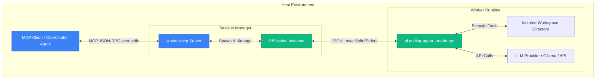
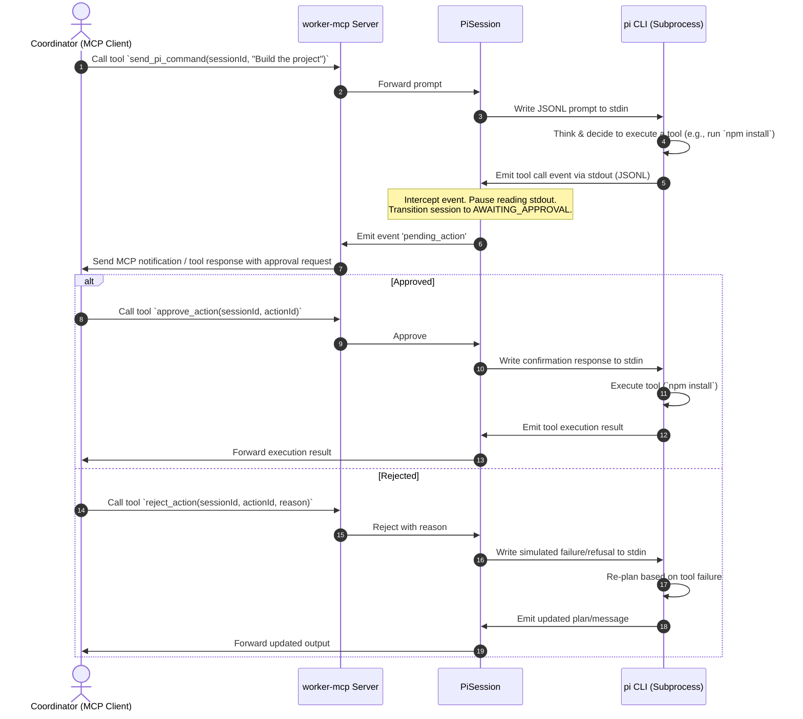

# Architecture & API Design: worker-mcp

This document details the software architecture, process interactions, and MCP tool/resource schemas for `worker-mcp`.

---

## 1. Component Architecture

The system consists of three layers:

### 1.1. Components
1. **MCP Client (Coordinator Agent)**: The orchestrator (e.g., Antigravity, Claude Desktop) that wants to delegate work but supervise the local execution.
2. **`worker-mcp` Server**: The MCP server that registers tools and resources, monitors child processes, and manages the interactive supervision loop.
3. **PiSession Instance**: A state wrapper in `worker-mcp` managing a single active worker session. It handles the stdin/stdout JSON Line parser, keeps track of command history, logs, and pending approval states.
4. **`pi` CLI Subprocess**: The globally/locally installed `@earendil-works/pi-coding-agent` executing in RPC mode (`pi --mode rpc`).
5. **LLM Provider**: The model runtime (e.g. Ollama for local LLMs, or cloud models via API) that the `pi` agent connects to.
6. **Workspace**: The specific local directory where the `pi` agent is executing commands and modifying files.

---

## 2. Interactive Supervision & Approval Flow

Because the local `pi` agent is less intelligent, we must gate high-risk actions (like bash commands or file modifications). The following diagram describes how `worker-mcp` intercepts a tool execution to ask the coordinator for approval:

---

## 3. API Schema

### 3.1. MCP Tools

`worker-mcp` exposes the following tools to the coordinator:

#### `spawn_pi_session`
Creates and initializes a new `pi` agent session.
* **Arguments**:
  * `sessionId` (string, required): A unique identifier for the session.
  * `cwd` (string, required): The directory path where the `pi` agent will execute.
  * `model` (string, optional): LLM model name to override the default (e.g., `ollama/qwen2.5-coder:7b`, `anthropic/claude-3-5-sonnet`).
  * `systemPrompt` (string, optional): Custom system instructions to append or override.
* **Returns**: `{ success: boolean, status: string }`

#### `send_pi_command`
Sends a prompt or slash command to a running session.
* **Arguments**:
  * `sessionId` (string, required): The ID of the target session.
  * `command` (string, required): The text prompt or slash command (e.g., `/model`, `/reload`, or a standard prompt).
* **Returns**: `{ success: boolean, responseText: string }` (or starts streaming response if supported).

#### `list_pi_sessions`
Lists all active sessions and their status.
* **Arguments**: None.
* **Returns**: An array of objects: `[{ sessionId: string, cwd: string, status: string, pendingAction: object | null }]`

#### `get_pending_actions`
Retrieves details of any action currently awaiting coordinator approval.
* **Arguments**:
  * `sessionId` (string, required): The target session ID.
* **Returns**: `{ sessionId: string, actionId: string, tool: string, arguments: object, context: string }`

#### `approve_action`
Approves a pending tool call.
* **Arguments**:
  * `sessionId` (string, required): The target session ID.
  * `actionId` (string, required): The ID of the intercepted tool call.
* **Returns**: `{ success: boolean }`

#### `reject_action`
Denies a pending tool call and sends a rejection/error message back to the worker agent.
* **Arguments**:
  * `sessionId` (string, required): The target session ID.
  * `actionId` (string, required): The ID of the intercepted tool call.
  * `reason` (string, optional): The reason for rejection (which will be fed back to the LLM to help it correct course).
* **Returns**: `{ success: boolean }`

---

## 4. MCP Resources & Prompt Templates

### 4.1. Resources
* **`worker-mcp://sessions/{sessionId}/history`**: Exposes the complete JSON history of messages exchanged inside the `pi` session. Useful for the coordinator to review the exact chain of thought.
* **`worker-mcp://sessions/{sessionId}/logs`**: A real-time log of events, tool executions, and stdout streams from the spawned process.

### 4.2. Prompts (Templates)
* **`supervise-task`**: A prompt template for the coordinator agent explaining how to command the worker, monitor the progress, and audit tool execution safely.

---

## 5. Operational Design

### 5.1. Locating the Pi Executable
* By default, `worker-mcp` attempts to execute the `pi` binary from the system's `PATH`.
* The binary path can be explicitly overridden by setting the `WORKER_MCP_PI_PATH` environment variable (e.g., `WORKER_MCP_PI_PATH=/usr/local/bin/pi`).

### 5.2. Automatic Gating Extension Injection
* Upon server startup, `worker-mcp` checks for the presence of the supervisor gating extension file at `~/.pi/agent/extensions/worker-mcp-gate.ts` (creating directories as needed).
* If missing, `worker-mcp` automatically writes the extension file. This ensures that any `pi` process spawned by the server (or run manually by the user) immediately inherits the interactive confirmation hooks.

### 5.3. Session Registry Persistence
* To survive restarts of the `worker-mcp` server, session metadata (mapping of `sessionId` -> `cwd`, model overrides, status, and system prompts) is persisted locally in `~/.config/worker-mcp/sessions.json`.
* When the server boots up, it reads this registry. Active sessions are marked as `Finished` or `Disconnected` until they are explicitly re-connected or spawned.

### 5.4. Subprocess Lifecycle & Stderr Management
* **Stderr Capture**: Stderr is piped separately from stdout. All stderr output from the `pi` child process is buffered and appended directly to the session's log stream (`worker-mcp://sessions/{sessionId}/logs`) to aid debugging.
* **Crash Detection**: If the child process exits with a non-zero code without completing, the session state transitions to `Crashed`.
* **State Transition back to Idle**: When `pi` emits the `agent_settled` event on stdout, `worker-mcp` updates the session status from `Running Task` back to `Idle`, notifying the coordinator that it is ready for the next command.

